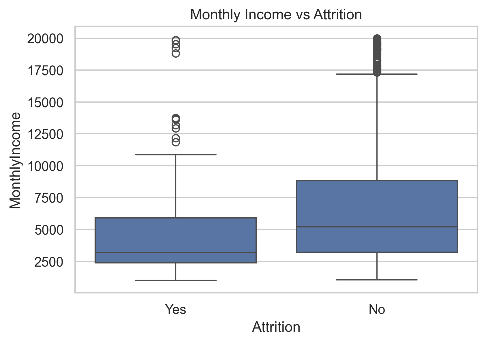
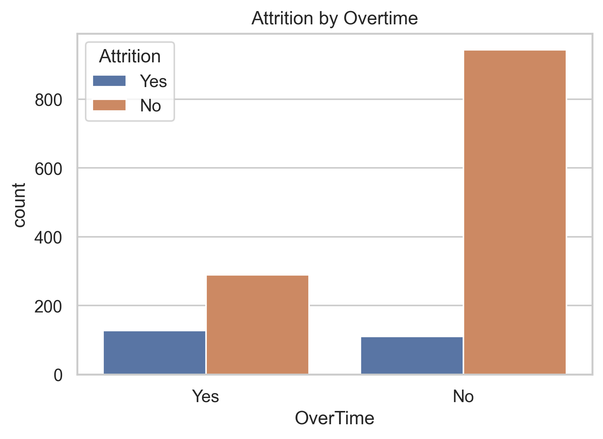
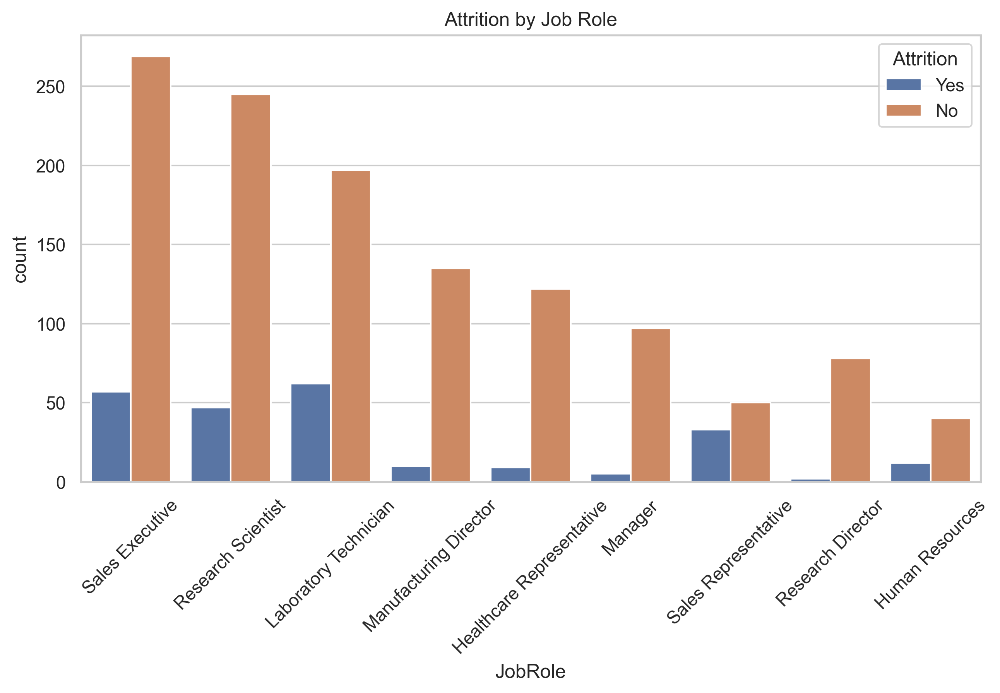

# HR Attrition Analysis (EDA Project)

## Project Overview

This project performs Exploratory Data Analysis (EDA) on employee attrition data to identify key factors contributing to employee turnover.

## Tools Used

• Python  
• Pandas  
• NumPy  
• Matplotlib  
• Seaborn  
• Jupyter Notebook  

## Project Workflow

1. Data Cleaning and Preprocessing
2. Exploratory Data Analysis (EDA)
3. Feature Engineering (Age Groups, Salary Groups)
4. Data Visualization
5. Business Insights and Recommendations

## Key Insights

• Employees aged 26–35 show highest attrition  
• Low salary employees have higher attrition  
• Sales Executive role has highest attrition  
• Overtime significantly increases attrition risk  
• Low job satisfaction leads to higher attrition  

## Key Visual Insights

### Overall Attrition Distribution

### Salary vs Attrition

### Overtime vs Attrition

### Attrition by Job Role

## Business Impact

This analysis helps organizations:

• Identify high-risk employees  
• Improve retention strategies  
• Optimize compensation policies  
• Improve employee satisfaction  

## Files

• hr_attrition_analysis.ipynb  
• hr_attrition.csv  

• README.md

